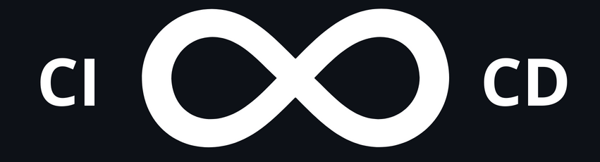

  <h1>
    Template Projeto X
  </h1>

  

    
  

Este é um projeto desenvolvido com a utilização de CI/CD, padrão de commits e Docker Compose. O objetivo é fornecer uma solução fácil e eficiente para o desenvolvimento, implantação e execução do projeto.

## CI/CD

Utilizamos o [GitHub Actions](https://github.com/features/actions) para automatizar o processo de integração e entrega contínua. A cada push na branch `main`, o processo de build, teste e deploy é iniciado.

## Padrão de Commits

Seguimos o [padrão de mensagens de commit](https://www.conventionalcommits.org/en/v1.0.0/) e exigimos que todas as contribuições sejam feitas usando o [Commitizen](https://github.com/commitizen/cz-cli). O Commitizen é uma ferramenta que ajuda a formatar mensagens de commit de forma padronizada, seguindo o padrão Conventional Commits. Para mais informações sobre como usar o Commitizen, consulte a [documentação](https://github.com/commitizen/cz-cli). Fazemos isso para manter a organização e histórico claro de mudanças no projeto.

## Docker Compose

Para facilitar a execução do projeto, utilizamos o [Docker Compose](https://docs.docker.com/compose/) para gerenciar os containers necessários para a execução do projeto. É importante observar que existe um diretório que separa os `Dockerfiles` para cada parte do projeto, mantendo a organização e facilidade de manutenção. Basta executar o comando `docker-compose up` na pasta raiz do projeto para iniciar a aplicação.

## Como executar o projeto

1. Clone este repositório para sua máquina local
2. Execute o comando `docker-compose up` na pasta raiz do projeto
3. Acesse a aplicação em `http://localhost:3000`

## Contribuir

1. Faça um fork deste repositório
2. Instale e configure o Commitizen
3. Crie sua feature na sua branch
4. Envie um pull request para a branch `main`

Observe que o processo de CI/CD será acionado ao receber o pull request e as mudanças só serão mescladas após o build, teste e deploy serem concluídos com sucesso.

